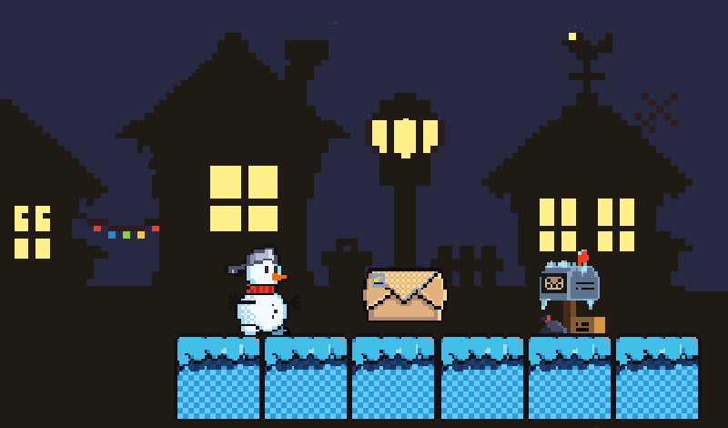

# Snowtime Delivery

This project is a good demo of working status of browser support for XNA, MonoGame and KNI.

This is a KNI port of [the original game](https://github.com/ongamex/winter_game_csharp). The original game can't be played in a browser, but this port can (on mobile too). The support of web portals like Yandex Games is also added.

# Links

* [itch.io game page](https://m039.itch.io/snowtime-delivery)
* [Yandex Games game page](https://yandex.ru/games/app/356358)
